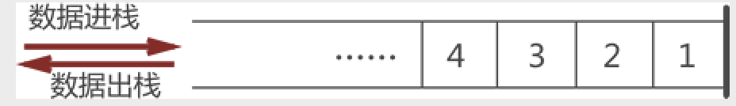

## Heap 堆

> 堆是<kbd>动态存储结构</kbd><kbd>完全二叉树</kbd>、<kbd>线性数据结构</kbd>、<kbd>一维数组</kbd>，分为最大堆和最小堆
> > 在 js 中 <kbd>动态分配的内存，大小不一定也不会自动释放，存放引用类型</kbd>
> > 最大堆：父节点的键值总是大于等于任何一个子节点的健
> > 
> > 最小堆：父节点的键值总是小于等于任何一个子节点的健
> > 

## Stack 栈

> 栈是<kbd>线性表</kbd>、<kbd>先进后出 LIFO (last in first out)</kbd>、<kbd>只能在表尾进行插入或删除</kbd>
> > 在 js 中 <kbd>自动分配内存空间，会自动释放，存放基本类型</kbd>、<kbd>占据固定大小的空间</kbd>、<kbd>提供代码执行的环境</kbd>
> > 

## Queue 队列

> 队列是<kbd>线性表</kbd>、<kbd>先进先出 FIFO（first in first out）</kbd>、<kbd>只能表头删除</kbd>、<kbd>只能在表尾插入</kbd>
> > 在 js 中 <kbd>存放各种异步操作所注册的回调</kbd>、<kbd>分两种任务类型：宏任务（macroTask)、微任务（microTask）</kbd>、<kbd>提供代码执行的环境</kbd>
> > 