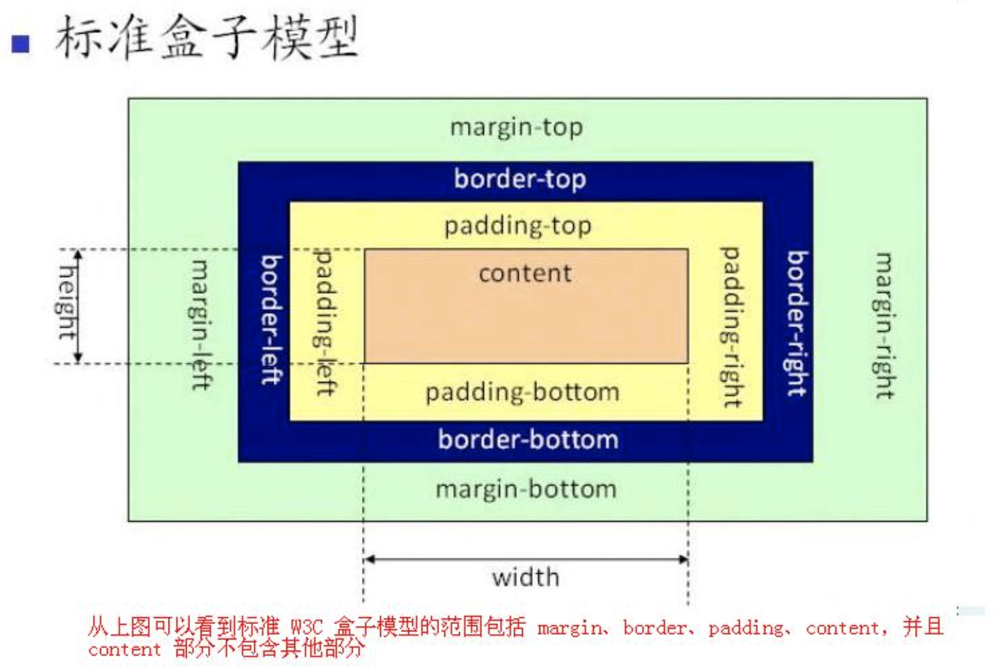
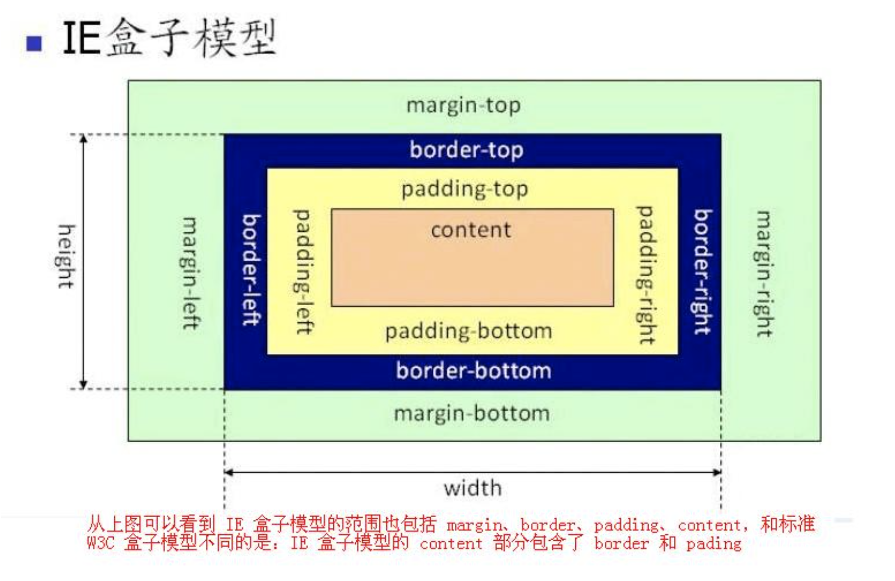

```
width   内容的宽度
height  内容的高度
padding 内边距
border  边框
margin  外边距
```
网页中最大的盒子是浏览器即document标签
------
## 标准盒模型 
>Content部分不包含其他部分
>

## IE盒模型
>Content部分包含了padding和border
>

## 清除默认样式（body默认的margin:8px，ul默认padding-left:40px）
```
*{
    margin: 0;
    padding: 0;
}

或

body,div,dl,dt,dd,ul,ol,li,h1,h2,h3,h4,h5,h6,pre,code,form,fieldset,legend,input,textarea,p,blockquote,th,td{
    margin: 0;
    padding: 0;
}
```